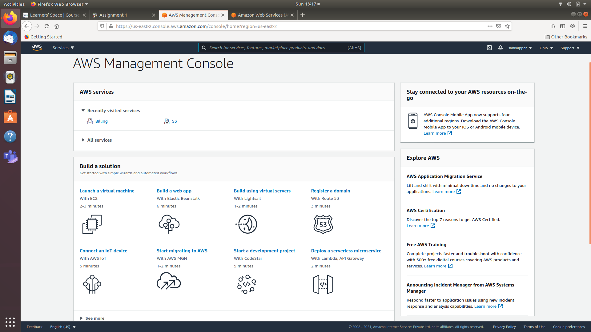

# Assignment 1
## Part 1
### Question 1
- AIOps stands for artificial intelligence for IT operations.
- It involves a series of platforms which automate IT to increase efficiency.
- The term AIOps was coined by Gartner in 2017 and is a relatively new technique.
- This involves use of machine learning, big data, and advanced analytics to improve IT infrastructure.
- Basically AI is used to find problems as well as solutions in the processes from development to products.
- For example - using AI to help determine the problem in development process and finding an appropriate solution.   
This is very different from MLOps which is a multidisciplinary approach to managing machine learning algorithms and involves collaboration between ML Engineers, Data Engineers and those involved deploying as well as monitoring the model. Basically MLOps is a way of streamlining the process from development to production for ML based tools whereas AIOps is an entirely different thing which involves application of AI to improve the efficiency of development process by finding problems as well as their solutions.
### Question 2
- Interpretability is the degree to which decisions made by a model can be understood or predicted by a human.
- By making the model interpretable we make the model more trustworthy as now we can understand the reason why the model made a particular prediction even if it was wrong.
- Instead of treating the model as a black box we can now understand the reasoning applied by the model to come to its conclusion.   
Linear Regression models are easily interpretable because they give their prediction as a linear weighted sum of the inputs. While this linearity makes it easily interpretable because linear functions can be easily understood by humans, it also is the main weakness for linear regression as it may lead to bias or underfitting. For instance, if the value of a numerical feature increase by one unit the output increase by the value of its weight so clearly higher the weight, higher is its correlation with the output.
### Question 3
AutoML automates the process of automation of selection, composition and parametrization of ML models. So by automating the entire process it basically streamlines the entire process from collection of data to deployment of ML models similar to MLOps. Some tools related to AutoML are-   
- Auto-Keras
- H2OAutoML
- AUTO-SKLEARN
- Amazon Lex
### References
- https://searchitoperations.techtarget.com/answer/Battle-of-the-buzzwords-AIOps-vs-MLOps-square-up
- https://opensource.com/article/21/2/aiops-vs-mlops
- https://christophm.github.io/interpretable-ml-book/limo.html
- https://analyticsindiamag.com/10-popular-automl-tools-developers-can-use/   
## Part 2

