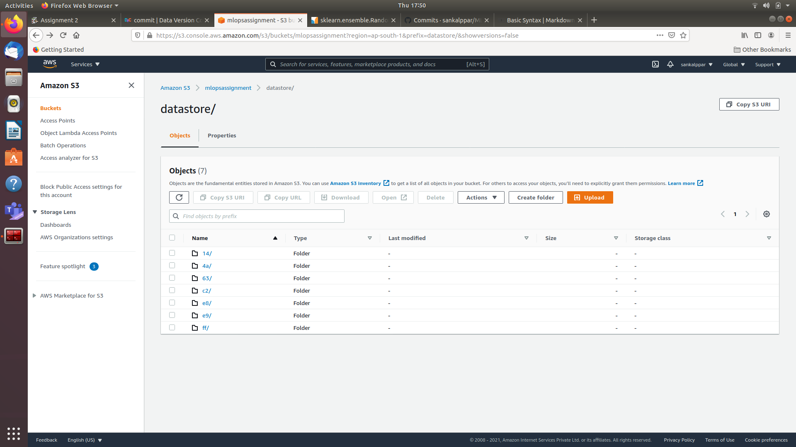

# Assignment 2
- Link to Assignment repo - https://github.com/sankalppar/MLOps_Assignment

## Part - 1
- git clone https://github.com/sankalppar/MLOps_Assignment
- dvc init
- mkdir data
- mkdir ~/external_cache
- dvc cache dir ~/external_cache
- dvc add data/creditcard.csv
- git add data/creditcard.csv data/.gitignore
- git commit -m "Added Raw Data"
- dvc remote add -d storage s3://mlopsassignment/datastore
- git add .dvc/config
- git commit -m "Configured Raw Storage"
- dvc push
- git push origin

##Part - 2
### Decision Tree
- Accuracy : 0.999280209265989
- F1 Score : 0.9992746245309851
### Random Forest
- Accuracy : 0.9996137708256526
- F1 Score : 0.9995918599416082

