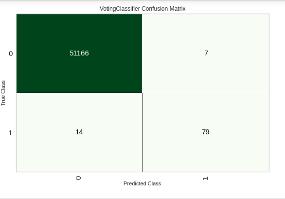
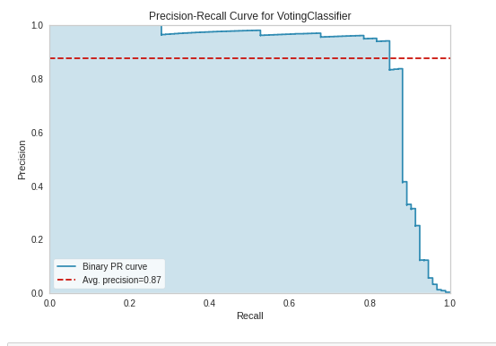

# Assignment 3
- Link to repo : https://github.com/sankalppar/MLOps_Assignment

## Preprocessing Techniques used:
- Ignored Feature Time because it was irrelevant to classification.
- Used normalization(zscore by default)
- Used fix_imbalance to make up for the imbalance in number of datapoints belonging to the two classes.
- Used polynomial_features for features of numeric kind.

## F1 scores

| Model | Score Before Tuning | Score After Tuning |
| ----- | ------------------- | ------------------ |
| Extra Trees Classifier | 0.8460 | 0.7000 |
| Random Forest Classifier | 0.8166 | 0.8170 |
| LGBM Classifier | 0.6907 | 0.7843 |
| K Neighbours Classifier | 0.5737 | 0.7525 |
| Decision Tree Classifier | 0.5116 | 0.5285 |

## Plots

## Metrics

- Accuracy : 0.9995
- Precision : 0.8636
- Recall : 0.8261
- F1 : 0.8444
